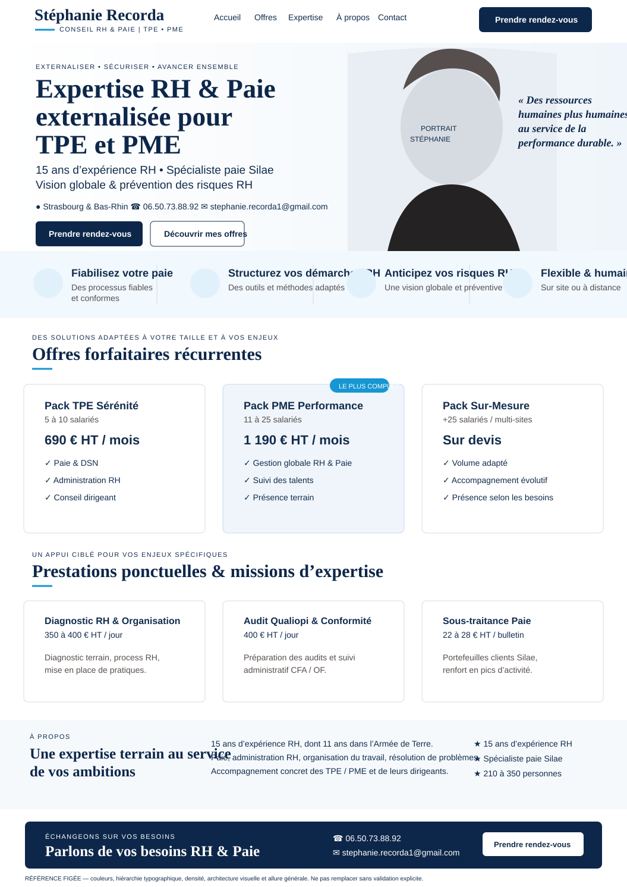

# Site Stéphanie Recorda

Site vitrine de **Stéphanie Recorda — Conseil RH & Paie pour TPE / PME**.

## État du projet

**Phase actuelle : cadrage / direction artistique.**

La page d’accueil de référence a été validée visuellement le **17 septembre 2026**. Elle est conservée dans `docs/reference/` et constitue la **référence figée** pour la palette, la typographie, les proportions, la densité, le style des cartes, le ton visuel et l’allure générale du futur site.

> Toute personne ou tout agent qui intervient sur ce dépôt doit lire **`AGENTS.md`**, puis **`HANDOFF.md`**, avant de modifier quoi que ce soit.

## Références du projet

- `HANDOFF.md` — état vivant du projet, décisions prises, travaux en cours et prochain point de reprise.
- `AGENTS.md` — protocole obligatoire pour toute personne / IA qui travaille dans le dépôt.
- `docs/DESIGN_REFERENCE.md` — règles visuelles issues de la preview validée.
- `docs/IDEAS.md` — backlog d’idées et pistes produit / UX.
- `content/SITE_CONTENT.md` — contenu et structure actuellement validés.
- `docs/reference/homepage-reference-2026-09-17.svg` — **référence visuelle figée du layout, des couleurs, de la hiérarchie typographique et de l’allure générale**.

## Positionnement

Stéphanie accompagne les TPE et PME sur les sujets RH et paie : gestion de la paie et des DSN, administration RH, structuration des pratiques, accompagnement du dirigeant, missions ponctuelles d’expertise et renfort paie.

Le site doit rester :

- professionnel mais humain ;
- très lisible et rassurant ;
- orienté vers la prise de contact ;
- compréhensible en quelques secondes par un dirigeant de TPE / PME ;
- sobre, sans jargon inutile ni promesses excessives.

## Offres actuellement prévues

### Forfaits récurrents

- **Pack TPE Sérénité** — 5 à 10 salariés — **690 € HT / mois**.
- **Pack PME Performance** — 11 à 25 salariés — **1 190 € HT / mois**.
- **Pack Sur-Mesure** — +25 salariés / multi-sites — **sur devis**.

### Prestations ponctuelles

- Diagnostic RH & Organisation du Travail — **350 à 400 € HT / jour**.
- Audit Qualiopi & Conformité CFA / OF — **400 € HT / jour**.
- Sous-traitance Paie (cabinets comptables) — **22 à 28 € HT / bulletin**.

Les textes détaillés et les règles d’orientation vers chaque offre sont centralisés dans `content/SITE_CONTENT.md` et `docs/IDEAS.md`.

## Principe UX retenu

Le site peut démarrer comme **une landing page / one-page**. Les trois packs ne doivent pas être des cartes décoratives : ils doivent mener à un détail de l’offre sur la même page ou dans un bloc dépliable, puis vers un CTA prérempli de type **« Échanger sur cette formule »**.

Le bandeau de quatre bénéfices situé sous le hero est un élément de **réassurance**, pas une navigation : ses éléments ne sont pas destinés à être cliquables.

Une piste prioritaire est un mini-diagnostic : **« Quelle offre me convient ? »** / **« Trouver mon offre en 1 min »**, afin d’orienter un prospect vers le pack le plus adapté sans transformer le site en tunnel complexe.

## Règle de continuité

Le projet doit pouvoir être repris par quelqu’un qui n’a jamais vu les conversations précédentes. **Le `HANDOFF.md` doit donc être mis à jour à chaque session où une décision, une modification ou un nouveau point de blocage apparaît.**

Ne pas considérer une décision comme acquise si elle n’est pas inscrite dans le dépôt.
